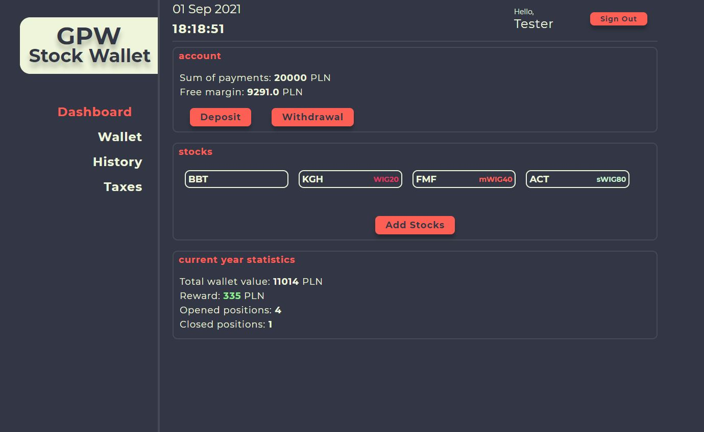

# GPW Stock Wallet



## Introduction

I created GPW Stock Wallet because I wanted to learn React while creating usefull application thanks to which I will be able to analyze the stock portfolio.
It is not finished app - I am going to develop it by creating new features and improving existing ones. Click [here](https://gpwstockwallet.netlify.app) to use GPW Stock Wallet.

## Technologies:

- Node 12.18.4,
- React 17.0.2,
- Styled-components 5.3.1,
- Firebase,

## How to start using GPW Stock Wallet ?

In order to start using GPW Stock Wallet you need to create user account. If you want to just test application, you can try on test account :

userName: tester@gmail.com
password: tester123

## Features:

- creating user account,
- money management ( deposit, withdrawal),
- adding stock to portfolio,
- selling stocks from portfolio,
- transaction details in wallet and archive,
- stock portfolio history,
- adding old transactions to the history,
- profit calculation

## Setup

To run this project, install it locally using npm:

```
$ cd ../lorem
$ npm install
$ npm start
```
